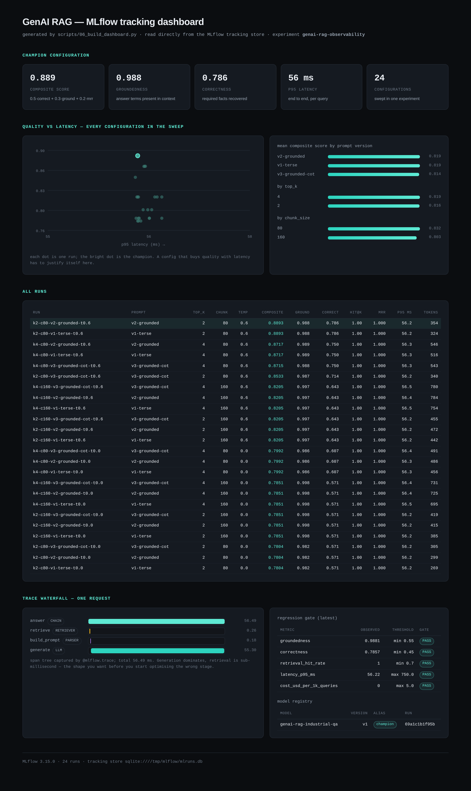
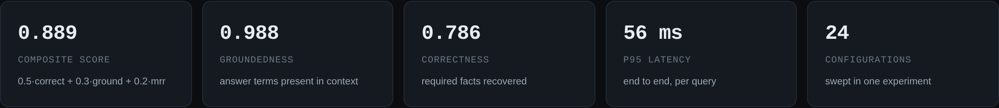
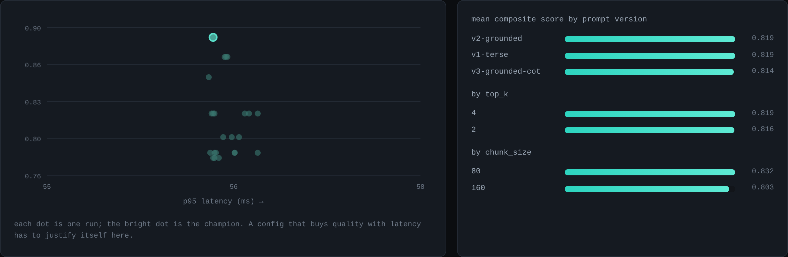
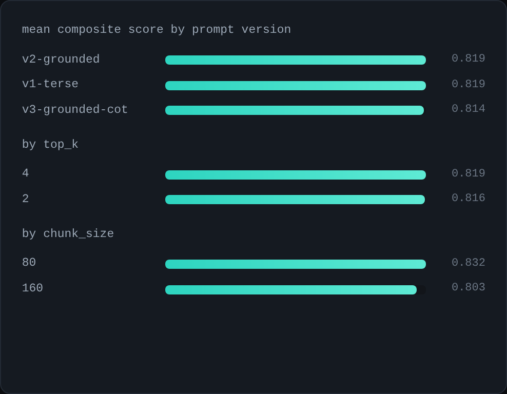
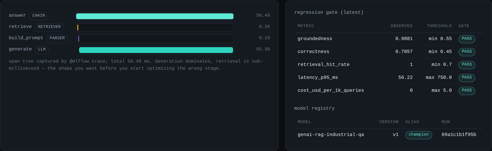

# MLflow for GenAI applications — end to end

Tracking a GenAI application is not tracking a training run. There is often no training run at
all, the interesting artifact is a prompt, and the failure modes are latency, cost, and
hallucination rather than validation loss.

This repo is a complete, runnable answer to "what does good MLflow instrumentation look like for a
RAG application?" It sweeps 24 configurations of a real retrieval pipeline, records a trace for
every request, evaluates each configuration on quality *and* cost *and* latency, registers the
winner, and then gates it behind a regression check that exits non-zero when quality drops.

It runs offline with no API key. `make demo` takes about a minute.

```bash
pip install -r requirements.txt
make demo          # prompts -> sweep -> register champion -> regression gate
make ui            # interactive MLflow UI at http://localhost:5000
```

---

## The dashboard

`scripts/06_build_dashboard.py` reads everything back out of the MLflow tracking store and renders
a static dashboard — the artifact you paste into a PR when the reviewer does not have access to
your tracking server. Every number below came out of MLflow; none of it is hardcoded.



### Champion configuration



### Quality against latency, and what each knob actually bought

The scatter is the whole argument for logging cost and latency next to quality: a configuration
that improves groundedness while tripling p95 is a *decision*, not an improvement, and it should
be visible in one screen.



Chunk size turned out to be the knob that mattered here (0.832 vs 0.803 mean composite). Prompt
version barely moved the needle, which is itself a useful result — it says the retrieval stage,
not the instruction wording, is where the remaining headroom lives.

### All 24 runs



### Trace waterfall and the regression gate



Generation is 98% of request latency and retrieval is sub-millisecond. That shape is worth knowing
before anyone spends a sprint optimising the vector store.

---

## What gets tracked, and why

| MLflow feature | Used for | Where |
|---|---|---|
| **Tracing** (`@mlflow.trace`) | Per-request span tree: `retrieve → build_prompt → generate`, with token counts and cost as span attributes | `src/genai_app/rag.py` |
| **Experiments / runs** | One run per configuration, with params, quality metrics, cost metrics, latency percentiles | `scripts/02_run_experiments.py` |
| **`log_table`** | Full per-question result table as a run artifact, so a bad aggregate can be drilled into | `scripts/02_run_experiments.py` |
| **Prompt Registry** | Prompt templates versioned independently of code | `scripts/01_log_prompts.py` |
| **Model Registry** | `pyfunc` wrapper of the winning config, promoted with the `champion` alias | `scripts/03_register_model.py` |
| **Regression gate** | Re-runs the champion, compares against thresholds, exits non-zero on regression | `scripts/04_regression_check.py` |

The discipline that makes this useful is logging the same three metric families on every single
run — **quality**, **cost**, **latency**. Any one of them alone will happily justify a change that
makes the system worse.

### Metrics logged per run

**Quality** — `groundedness`, `answer_relevance`, `correctness`, `refusal_rate`
**Retrieval** — `retrieval_hit_rate`, `retrieval_mrr`
**Cost** — `avg_total_tokens`, `cost_usd_per_1k_queries`
**Latency** — `latency_p50_ms`, `latency_p95_ms`
**Composite** — `composite_score` = 0.5·correctness + 0.3·groundedness + 0.2·MRR

---

## Layout

```
src/genai_app/
  rag.py          traced pipeline — every stage is an MLflow span
  retriever.py    TF-IDF retriever, zero dependencies (swap for Qdrant/pgvector)
  llm.py          provider abstraction: deterministic stub by default, OpenAI on a flag
  prompts.py      three prompt variants, registered as versioned entities
  scorers.py      groundedness / relevance / correctness / hit-rate / MRR
scripts/
  01_log_prompts.py        register prompt templates
  02_run_experiments.py    sweep 24 configs, one MLflow run each
  03_register_model.py     wrap champion as pyfunc, register, alias
  04_regression_check.py   threshold gate, non-zero exit on regression
  05_capture_screenshots.py  screenshot the live MLflow UI (Playwright)
  06_build_dashboard.py    render the static dashboard from the tracking store
data/
  corpus/         six industrial engineering documents
  eval_set.jsonl  15 questions, including one deliberately unanswerable
```

---

## Running against a real model

The default LLM is a deterministic extractive stub. That is a choice, not a limitation: it makes
`make demo` reproducible byte-for-byte on any machine, with no key and no spend, so the tracking
mechanics are what you are looking at rather than sampling noise.

```bash
export GENAI_PROVIDER=openai
export GENAI_MODEL=gpt-4o-mini
export OPENAI_API_KEY=sk-...
make demo
```

Nothing else changes. `cost_usd_per_1k_queries` starts reporting real money, and the composite
score starts moving on prompt version — which is exactly the comparison the sweep exists to make.

The stub does model two behaviours the prompt variants disagree about: it abstains when the top
retrieval score is weak *if* the prompt authorises abstention, and it drops zero-overlap passages
*if* the prompt asks it to select relevant passages first. Question `q15` in the eval set is
unanswerable from the corpus specifically to exercise that path.

## Swapping the heuristic scorers for LLM judges

`scorers.py` is deterministic on purpose — a judge model makes CI non-reproducible and costs money
per commit. The four dimensions map one-to-one onto `mlflow.genai` judges when you want them, and
`scripts/03_evaluate`-style integration is a drop-in at the `aggregate()` boundary in
`02_run_experiments.py`.

## A note on the screenshots

The images above are produced by `scripts/06_build_dashboard.py` plus a Playwright capture, from
the same tracking store `make demo` writes. `scripts/05_capture_screenshots.py` does the same for
the live MLflow UI (`make ui` first) if you want the interactive views in your own docs.

---

## License

MIT
